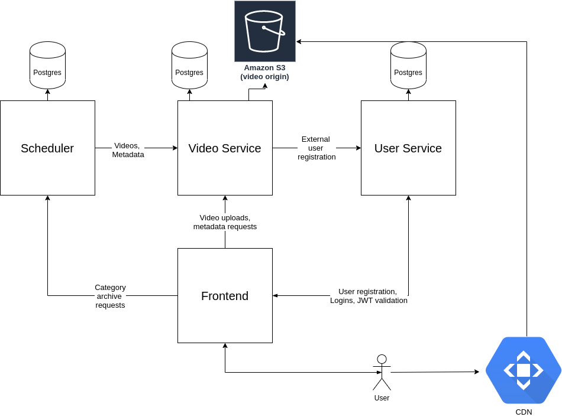

# horahora
Horahora is a microservice-based video hosting website with additional functionality for group content archival from Niconico, Bilibili, and Youtube.

This project is a WIP, and under active development. 

Join our discord here: https://discord.gg/psuj8QQ

## Architecture

Currently, there are three microservices:
1. User Service, which handles registration, logins, and JWT validation
2. Video Service, which handles video uploads (both from Scheduler and from users), transcoding/chunking as required for DASH, uploads to the origin, and storage of metadata.
3. Scheduler, which handles content archival requests from users. For example, if a user specifies that they'd like all videos on Niconico with the tag "YTPMV" to be downloaded, Scheduler will download those videos, register them (and their associated creator) with video service and user service, and check that category of content regularly for new videos.

All microservices are horizontally scalable, containerized, and communicate via gRPC.

The MVP will also consist of a frontend service to handle HTML templating, and a Censorship service (name is a WIP) to manage the workflow for video approvals, and censorship of obscene content from foreign websites.  

## How to Use
Currently, only local use is supported.
To run horahora locally, follow these steps:
1. First install the following depdendencies:
  - Flyway
  - Docker
  - Kubernetes

2. Start minikube, and use `./run-local.sh` in the Kubernetes directory. If the database migrations fail to apply, keep running run-local.sh until they succeed.
3. `./run-tests.sh` will run local integration tests. Currently, this will send an archival request to scheduler for all YTPMVs on Niconico.

## Missing Essential Features
The following is a non-exhaustive list of features which should be added for the MVP:
1. A frontend
2. redis locking (or some other form of distributed locking) for video downloads to prevent concurrent downloads of the same videos from two categories of content
3. Extended archival request support. Currently, only tags archive requests from Niconico are supported.
4. Expanded unit tests
5. Expanded integration tests
6. A less awkward local development workflow
7. All necessary AWS infrastructure:
  - autoscaling EKS cluster
  - log aggregation
8. Videoservice support for regular video uploads
9. Scheduler should send video tags to videoservice
10. Microservice to manage video approval workflow and flagging/censorship of obscene content
11. Tracking views/upvotes/downvotes for videos
  
## Missing Non-essential Features
1. L7 load balancing between services with Envoy
2. Scheduler should be refactored a bit
3. Videoservice should be refactored a bit

